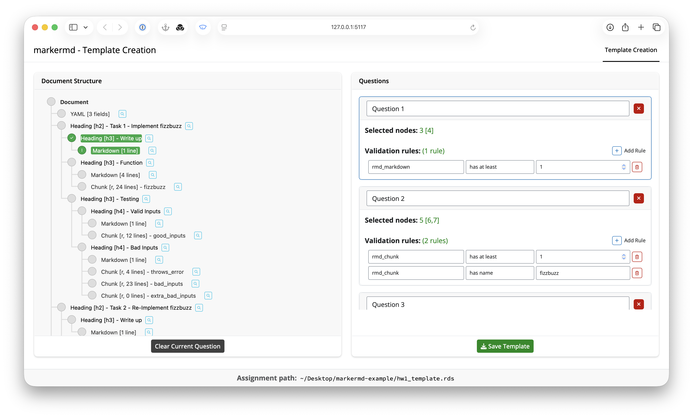
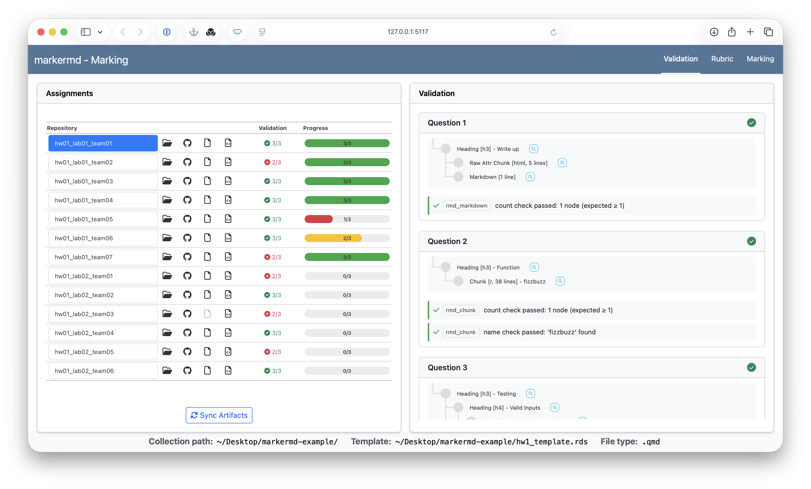
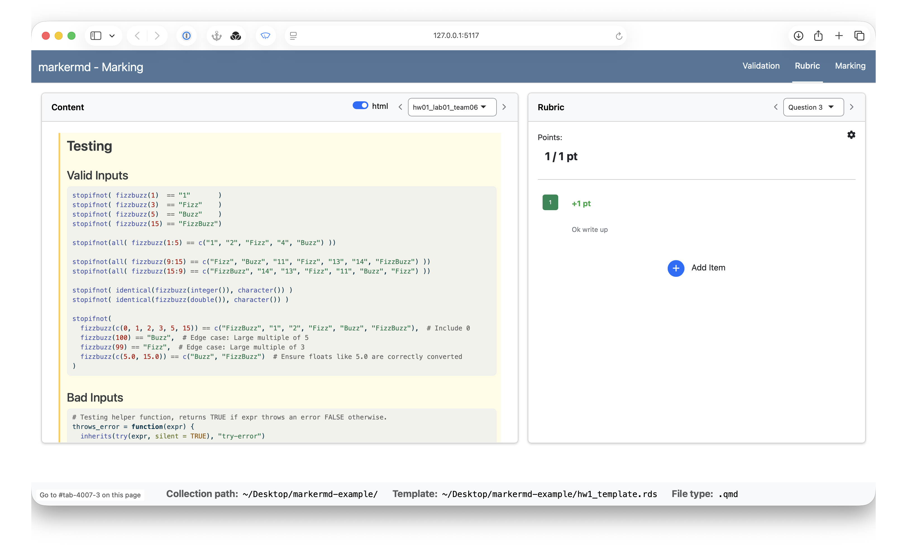

# markermd

<!-- badges: start -->
[](https://lifecycle.r-lib.org/articles/stages.html#experimental)

[](https://github.com/rundel/marketed/actions/workflows/R-CMD-check.yaml)
<!-- badges: end -->

> **Interactive Shiny-Based Grading Interface for R Markdown Assignments**

markermd provides a comprehensive Shiny-based interface for grading assignments submitted as git repositories containing R Markdown or Quarto documents. It features template creation with validation rules, interactive AST tree visualization, question-based grading workflows, and automated validation systems.

## ⚠️ Experimental Status

This package is currently in **experimental** development. APIs may change significantly, and some features may not be fully stable. Use with caution in production environments.

This project is also an experimental exercise in "vibe" coding with claude code - not all implementation details have been thoroughly evaluated and there is a lot
of wonkiness throughout the codebase.

## Key Features

- 📝 **Template Creation**: Interactive interface for creating grading templates with validation rules
- 🌳 **AST Visualization**: Explore document structure through interactive abstract syntax trees
- ✅ **Automated Validation**: Define and apply validation rules to check assignment requirements  
- 📊 **Question-Based Grading**: Organize grading around specific questions with customizable rubrics
- ⌨️ **Hotkey Support**: Fast grading workflows with keyboard shortcuts
- 🔗 **GitHub Integration**: Support for both local directories and remote GitHub repositories
- 📋 **Export Options**: Export grades and feedback in various formats (*Coming soon*)

## Installation

You can install the development version of markermd from GitHub:

```r
# Install from GitHub
# install.packages("pak")
pak::pak("rundel/markermd")

# Or using remotes
remotes::install_github("rundel/markermd")
```

### Dependencies

markermd relies on the development version of [parsermd](https://github.com/rundel/parsermd) for parsing R Markdown and Quarto documents:

```r
remotes::install_github("rundel/parsermd")
```

## Quick Start

*Coming soon ...*

## Core Workflows

### 1. Template Creation (`template()`)

The template creation interface allows you to:

- Load and explore an assignment through an interactive AST tree representation
- Map specific AST nodes (headings, code chunks, etc.) to assignment questions
- Define validation rules (content checks, node counts, etc.) for each question
- Save reusable templates for consistent grading

### 2. Assignment Grading (`mark()`)

The grading interface provides:

- **Validation Tab**: Automated checking of assignment requirements and resources
- **Rubric Tab**: Question-by-question grading with customizable point values


## Repository Structure

markermd expects assignments to be organized as:

```
assignments/
├── student1-repo/
│   ├── assignment.qmd  # or .Rmd
│   └── ...
├── student2-repo/
│   ├── assignment.qmd
│   └── ...
└── ...
```

For GitHub repository integration, the package can automatically:
- Clone repositories from GitHub
- Sync updates from remote repositories


## Examples


### Template Creation Interface



The template interface shows:
- Document AST tree for node selection
- Question management panel  
- Validation rule configuration
- Template save/load functionality

### Grading Interface

#### Validation


#### Grading Rubric  



## Contributing

markermd is in active development. Contributions, bug reports, and feature requests are welcome!

## License

GPL (>= 3)
